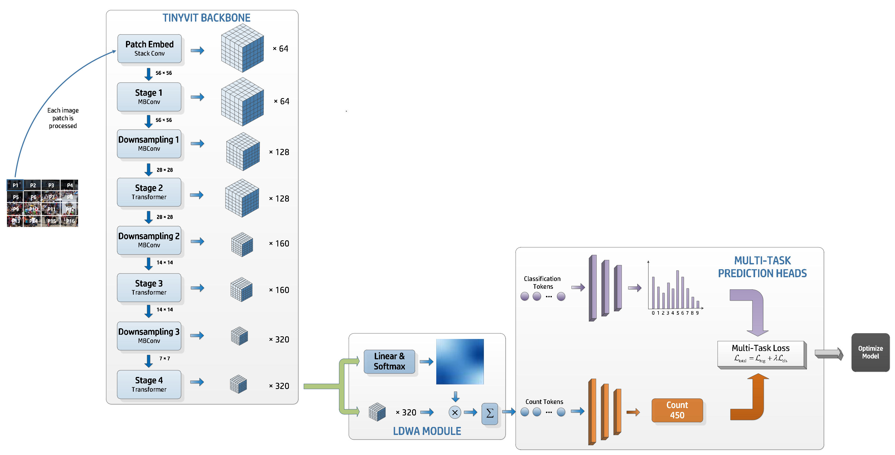

# TCFormer: A 5M-Parameter Transformer with Density-Guided Aggregation for Weakly-Supervised Crowd Counting
* This repository contains the model weights for our paper, TCFormer: A 5M-Parameter Transformer with Density-Guided Aggregation for Weakly-Supervised Crowd Counting. The full source code is available upon request by contacting the author at guoqiang01486@dlnu.edu.cn 

## Overview


# Environment

- Required packages are listed in "pip.list.txt" file. *Please make sure to install them before running.

# Datasets
Three datasets are utilized in our proposed method, where links are shown below:
- Download ShanghaiTech dataset from [Baidu-Disk](https://pan.baidu.com/s/15WJ-Mm_B_2lY90uBZbsLwA), passward:cjnx; or [Google-Drive](https://drive.google.com/file/d/1CkYppr_IqR1s6wi53l2gKoGqm7LkJ-Lc/view?usp=sharing)
- Download UCF-QNRF dataset from [here](https://www.crcv.ucf.edu/data/ucf-qnrf/)
- Download NWPU-CROWD dataset from [Baidu-Disk](https://pan.baidu.com/s/1VhFlS5row-ATReskMn5xTw), passward:3awa; or [Google-Drive](https://drive.google.com/file/d/1drjYZW7hp6bQI39u7ffPYwt4Kno9cLu8/view?usp=sharing)


# Prepare SH dataset
### 1 step
```
python data/predataset_sh.py
```
### 2 step
```
python make_npydata.py
```

# Testing

*Please note that the reproduced results may differ slightly (within approximately 0.1 MAE/MSE) from those reported in the paper when using non-A100 GPUs.*

##### SH PartA
```
* MAE 63.716
 * MSE 105.308
  * best MAE 63.716
python test_tvit_sh.py --dataset ShanghaiA --gpu_id 2  --pre model_best_parta.pth
```

##### SH PartB
```
* MAE 8.341
 * MSE 14.541
 * best MAE 8.341
python test_tvit_sh.py --dataset ShanghaiB --gpu_id 2  --pre model_best_partb.pth
```

## Citation
You may consider kindly citing our work if you find this useful. Great thanks!

``` bibtex
@misc{guo2025tcformer5mparametertransformerdensityguided,
      title={TCFormer: A 5M-Parameter Transformer with Density-Guided Aggregation for Weakly-Supervised Crowd Counting}, 
      author={Qiang Guo and Rubo Zhang and Bingbing Zhang and Junjie Liu and Jianqing Liu},
      year={2025},
      eprint={2512.22203},
      archivePrefix={arXiv},
      primaryClass={cs.CV},
      url={https://arxiv.org/abs/2512.22203}, 
}
```

# Acknowledgement
This code is heavily built on [DSFormer](https://github.com/ZaiyiHu/DSFormer). We sincerely thank the authors for sharing the codes.

